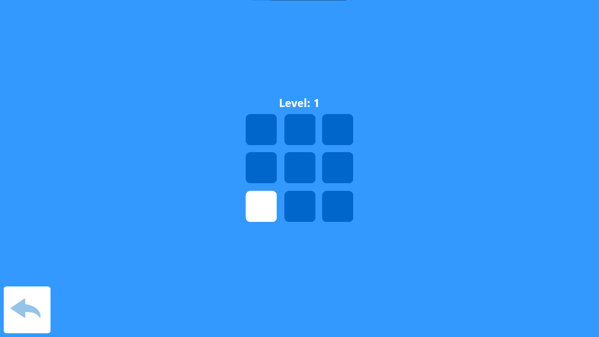

# HumanBenchmark

## Опис на апликација
Апликацијата е имплементација од страната www.humanbenchmark.com, поточно игрите Reaction Time, Sequence Memory, Word Memory и Number Memory

Дополнително апликацијата автоматски зачувува максималните поени освоени за секоја игра

## Упатство за користење

Од главното мени се избира која игра корисникот сака да ја игра

### Reaction Time

Целта на играта е да се притисне со најмало време поминато при промената на панелот од црвена во зелена боја.

По отварање на играта се пристигнува на следниот изглед

Со притискање на плавото се менува во следното

По поминато произволно време помеѓу 0.5 и 3 секунди се менува во следното

При притискање на зеленото се прикажува времето кое сте го добиле и се додава во минатите 5 времиња подоле, исто така се чива најголемото постигнато време во оваа сесија на играње, како и најдобро време постигнато досега и во предходни сесии

Со повторно притискање играта повторно почнува

### Sequence Memory
Целта на играта е да се запамти низата која се прикажува на играчот, и истата да се повтори.

Со започнување на играта се притистигнува на следниот изглед

Со притискање на копчето се покажува низата на играчот и после тој треба да ја повтори со притискање на квадратите

По направена грешка се покажува до кое ниво стигнал играчот и се овозможува пак да започне

### Word Memory
Целта на играта е да се одбере дали покажаниот збор бил предходно покажан

Со отварање на играта се пристигнува на следниот изглед

Со започнување се покажува збор и опции дали е нов или предходно бил покажан

По направена грешка се прикажува за колку зборови играчот одговорил точно

### Number Memory
Целта на играта е да се запамте прикажаниот број, со секој точен одговор се зголемува колку цифрен е бројот

Со отварање на играта се добива следниот изглед

Со започнување се прикажува бројот и одтекува време

По истекувањето на времето се чека играчот да го напише бројот

Се прикажува точниот број и бројот напишан од страна на играчот и ако тие се исти може да се продолжи понатаму, додека ако не се може да се започни од почеток

### Highscores
Се отвара со притискање на трофејот од главното мени и ги покажува најдобрите резултати постигнати од играчот.
До секој од резултатите има копче за тие да се избришат

## Решение на проблемот

Секоја игра е направена во сопствена форма и се состои од сопствена логика.

Играта Number Memory

